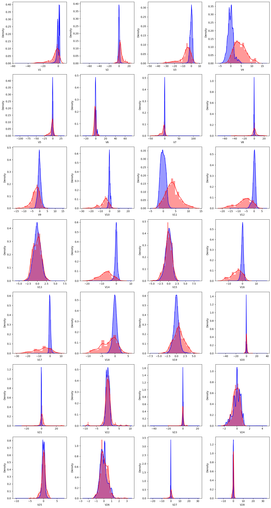
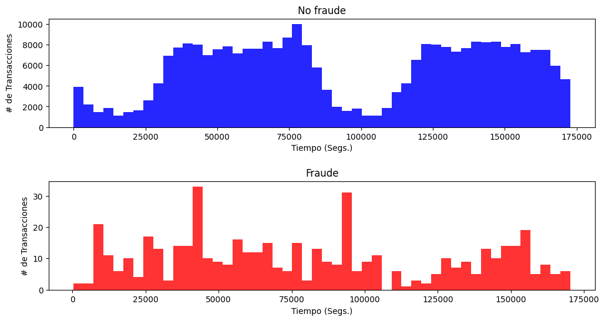
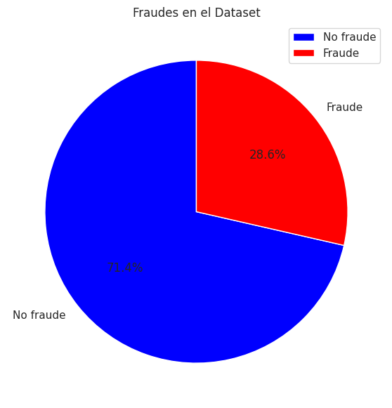
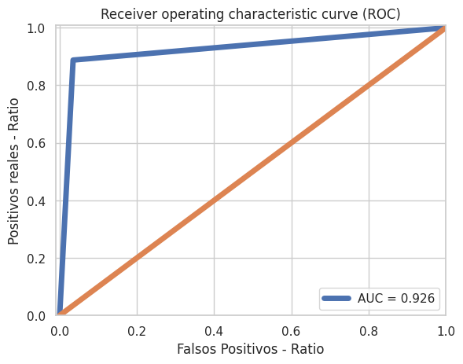

# DETECCIÓN DE FRAUDES EN TRANSACCIONES POR TARJETA DE CRÉDITO

## 📌 Descripción del Proyecto  
Sistema de detección de fraude en transacciones con tarjetas de crédito implementando técnicas de *machine learning* para identificar transacciones fraudulentas en un dataset altamente desbalanceado.

---

## 📊 Dataset  

`creditcard.csv` contiene:

- **284,807 transacciones** (492 fraudulentas - 0.172%)
- Características:
  - `Time`: Tiempo desde la primera transacción
  - `V1` - `V28`: Componentes principales (PCA anonimizado)
  - `Amount`: Monto ($)
  - `Class`: Variable objetivo (0 = normal, 1 = fraudulenta)

## Resultados de Ejecucion
### COMPOSICION DEL DATASET

### RELACIONES ENTRE LAS CLASES (FRAUDE - NO FRAUDE)

### DISTRIBUCION DEL DATASET

### RESULTADOS DE LA CLASIFICACION

